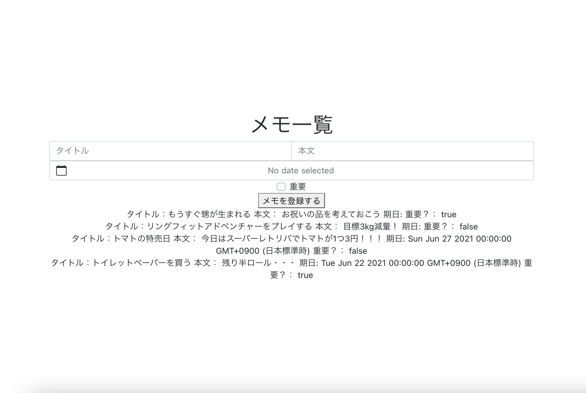
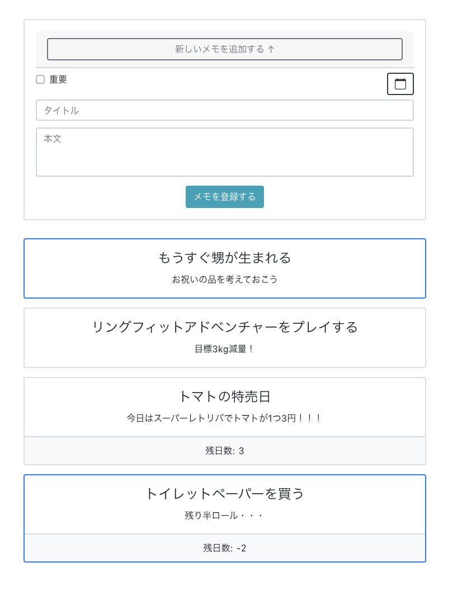
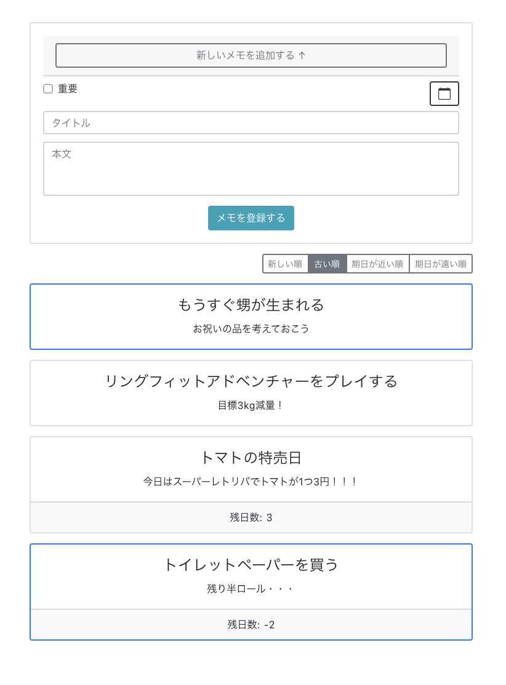

## 前置き
本課題は課題1~3と発展課題の計4つのコーディング課題からなり、全課題を回答するのに4時間かかります。各課題は繋がっておりますので、例えば先に課題3を解いてから課題1に取り組むことはできません。

### 回答の提出方法
各課題への回答は以下のように行ってください。

**弊社から事前に GitHub のリポジトリが共有されている場合**

各課題に対してプルリクエストを作成してください。課題2以降のプルリクエストは直前の課題に対応するブランチに向けることで、その課題に関する差分のみがプルリクエスト上で確認できるようにしてください。
ブランチ名は `${あなたのイニシャルまたはハンドルネーム}_test1` などとし、ブランチ名が他のブランチと被らないようにしてください。

**弊社から GitHub のリポジトリが共有されていない場合**

zip 形式でお渡しする場合など、GitHub のリポジトリが共有されていない場合は、各課題に対してこのディレクトリを zip ファイルなどに圧縮し、弊社担当者宛にお送りください。

### 十分な回答時間が確保できない場合

2時間以上の回答時間が確保できる場合は、課題1~3に取り組んでください。確保できる回答時間が2時間未満の場合は以下の時間配分で取り組んでください。

* 課題1と課題2にそれぞれ 2:1 の時間配分で取り組んでください。回答提出時に回答時間をお教えください。
* 課題3の実装方針を立て、TODOリストの形で提出してください。提出形式は問いません。課題1, 2の提出時にテキストベースで添えていただくだけで構いません。


## セットアップ

このアプリケーションの開発環境は docker-compose の利用を前提としています。コマンドの詳細については[公式ドキュメント](https://docs.docker.jp/compose/toc.html)を参照してください。

```bash
$ docker-compose build
$ docker-compose run --rm app yarn install
$ docker-compose up -d
```

※ ソースコードの改行コードが CRLF になっているとコマンドが正しく実行できない場合があります。改行コードを LF に変換して再度実行してください。

ブラウザ上で localhost:3000 にアクセスしてください。

## 課題

あなたはメモアプリを開発するチームのフロントエンドエンジニアです。
メモアプリは開発途上です。



あなたはメモアプリのフロント側の機能開発およびスタイル調整担当で、今後の機能追加に耐えうる設計でフロントエンドを開発することを期待されています。

このアプリは Nuxt.js を用いて作られており、Nuxt Property Decorator, BootstrapVue などのライブラリが使用されています。
アプリのメインカラーは `#53B9C6` 、サブカラーは `#E896BC` を予定しています。

この情報を基に、以下の課題に取り組んでください。

### 課題1（回答時間：1時間）

下記の画像を参考に、制限時間内で可能な限りメモアプリのスタイルを調整し、このページの機能が分かりやすくなるようにしてください。具体的には以下の機能が UI 上分かるようにしてください．

* フォームに入力することでメモを追加することができる。
* 重要なメモには重要フラグを付けて、目立つようにできる。
* メモに期日を設定できる。

制限時間内で取り組めなかった部分に関しては、課題提出時に、あとどれくらいの時間でどういうことができる見込みかを教えてください。



### 課題2（回答時間：30分）

メモアプリに新たに、メモの並び順を変える機能を搭載したいです。下記の画像を参考に、メモの表示順をメモの作成順および期日順で切り替えられるようにしてください。



### 課題3（回答時間：30分）

重要フラグが付いたメモを目立つようにしたいです。
- 重要フラグが付いたメモが、常に先頭に表示されるようにしてください。
- 重要フラグが付いたメモに、背景色を変えるなどの調整を自由に加えて目立つ配色にしてください。

制限時間内で取り組めなかった部分に関しては、課題提出時に、あとどれくらいの時間でどういうことができる見込みかを教えてください。

### 発展課題（回答時間：1時間）

期日が近い（1日前〜）メモ、および、期日を過ぎたメモは、重要フラグとは異なる配色で目立つようにしてください。
期日を過ぎたメモがある場合は、画面上部に「期日を過ぎたメモがx件あります」のような注意喚起の文言を表示して、
文言をクリックすると、期日を過ぎたメモだけを一覧表示できるようにしてください。
